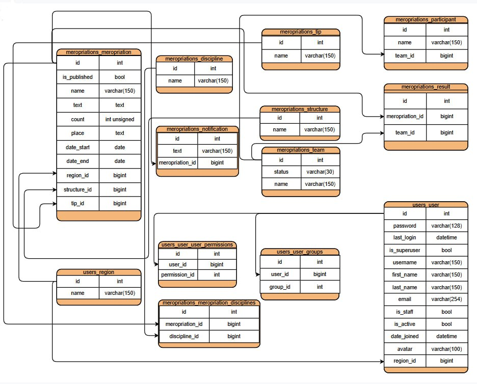
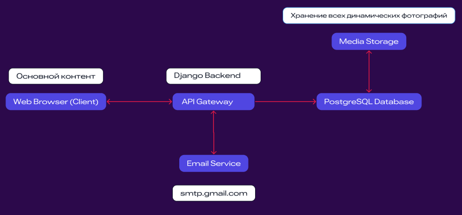

# Center FSP
## Платформа, которая улучшит координацию между ФСП и регионами, упростит процессы подачи и обработки заявок, а также повысит качество общения и управления данными.
***

### Инструкция по запуску проекта
Все команды вводятся в терминале.  
**Необходимо иметь установленные pip и python для терминала.**

#### Клонируем проект

```commandline
git clone https://github.com/hackathonsrus/pp_final_20299_pfo_ta_litseisti_kfu_102
```

#### Переходим в папку pp_final_20299_pfo_ta_litseisti_kfu_102

```commandline
cd pp_final_20299_pfo_ta_litseisti_kfu_102
```

#### Создайте в коренной папке проекта файл `.env` рядом с `center_fsp`

***Для Linux системы используйте следующую команду***
```commandline
touch .env
```

#### Скопируйте содержимое `.env.example` в `.env`
#### Windows
Если вы используете командную строку (cmd):
```commandline
copy .env.example .env
```
Если вы используете PowerShell:
```commandline
Copy-Item .env.example .env
```
***

#### Linux / macOS
В терминале используйте команду:
```commandline
cp .env.example .env
```

### Команды для запуска проекта с Docker - PostgreSQL

***Для этого варианта требуется установленный <a href='https://www.docker.com/products/docker-desktop/'>Docker</a>, а также в `.env` нужно 
прописать значение `USE_DOCKER=True`***
***

#### 1. Для билда Docker-образа и запуска его используйте команду:
```commandline
docker-compose up --build
```

#### 2. Переходим на сайт

#### <a href="http://localhost:8000/">http://localhost:8000/</a>

***Терминал не закрываем!***

### Команды для запуска проекта без Docker - SQLite
***Для этого варианта требуется прописать значение в `.env` `USE_DOCKER=False`***
***

#### 1. Создаём и активируем виртуальное окружение
Рекомендуется использовать виртуальное окружение для изоляции зависимостей:<br>
Для Windows:
```commandline
python -m venv venv
venv\Scripts\activate
```

Для MacOS/Linux:
```commandline
python3 -m venv venv
source venv/bin/activate
```

#### 2. Устанавливаем зависимости

```commandline
pip install -r requirements.txt
```

#### 3. Переходим в папку с manage.py

```commandline
cd center_fsp
```

#### 4. Настраиваем миграции

```commandline
python manage.py migrate
```

#### 5. Запускаем сервер 

```commandline
python manage.py runserver
```

#### 7. Загрузите фикстуры для БД

```commandline
python manage.py loaddata fixtures/data.json
```

#### 6. Переходим на сайт

#### <a href="http://localhost:8000/">http://localhost:8000/</a>

***Терминал не закрываем!***

### Возможные ошибки запуска
#### В случае возникновения ошибки с venv\Scripts\activate 

Решение проблемы:
- Открываем терминал PowerShell от админа.
- Вставляем и запускаем `Set-ExecutionPolicy RemoteSigned`
- На вопрос отвечаем `A`
- Продолжаем запускать проект по инструкции README.md с `Создаём и активируем виртуальное окружение`

#### Ошибка при загрузке requirements

Если у вас установлены несколько версий Python, используйте путь к нужной версии. Например, чтобы использовать Python 3.8, выполните команду:

**На Windows:**
```commandline
C:\path\to\python3.8\python.exe -m venv venv
```

Замените `C:\path\to\python3.8\python.exe` на путь к нужной версии Python, которую вы хотите использовать.

**На macOS/Linux:** <br>
Если у вас установлена нужная версия Python, вы можете использовать команду: <br>
```commandline
python3.8 -m venv venv
```

### Хостинг

<a href="https://mario12508.pythonanywhere.com/">https://mario12508.pythonanywhere.com/</a>

Представитель ФСП (суперюзер)
```
Логин: admin_fsp
Пароль: admin123
```

Представители регионов

| Регион  | Логин | Пароль |
|---------|-------|--------|
| Москва | Moskow | gorod_Moskva |
| Белгородская область | Belgorod | Egor_lushi |
| Брянская область | Bryansk |	Oleg_lushi |
| Владимирская область | Vladimir | Anastasia_lushi |
| Воронежская область | Voronezh | Ulianov_lushi |
| Ивановская область | Ivanovo | Sergei_lushi |
| Калужская область | Kaluga | Alesha_lushi |
| Костромская область | Kostroma | Dmitri_lushi |
| Курская область | Kursk | Zhuravl_lushi |
| Липецкая область | Lipetsk | Daniil_lushi |
| Московская область | Moscow-obl | Jenia_lushi |
| Орловская область | Oryol | Aleksandr_lushi |
| Рязанская область | Ryazan | Evgenia_lushi |
| Смоленская область | Smolensk | Sergei_lushi |
| Тамбовская область | Tambov | Maksim_lushi |
| Тверская область | Tver | Petr_lushi |
| Тульская область | Tula | Aleksei_lushi |
| Ярославская область | Yaroslavl | Dmitri_lushi |
| Республика Адыгея | Adygea | Marat_lushi |
| Республика Калмыкия | Kalmykia | Arkadii_lushi |
| Краснодарский край | Krasnodar | Sergei_lushi |
| Астраханская область | Astrakhan | Ulia_lushi |
| Волгоградская область | Volgograd | Elena_lushi |
| Ростовская область | Rostov | Stanislav_lushi |
| город Севастополь | Sevastopol | Mishail_lushi |
| Республика Крым | Crimea | Sergei_lushi |


### Видеодемонстрация

[Скачать видеодемонстрацию проекта](https://github.com/hackathonsrus/pp_final_20299_pfo_ta_litseisti_kfu_102/raw/main/Видеодемонстрация.mp4)

### 📂 Структура проекта

```
project_center_fsp/
├── center_fsp/
│   ├── center_fsp/              # Основная конфигурация Django проекта
│   │   ├── settings.py          # Основные настройки
│   │   ├── urls.py              # URL маршруты проекта
│   │   ├── wsgi.py              # Конфигурация для WSGI-сервера
│   │   ├── asgi.py              # Конфигурация для ASGI-сервера
│   ├── media/                   # Загружаемые пользователями файлы
│   ├── static_dev/              # Статические файлы (CSS, JS, изображения)
│   ├── templates/               # Глобальные HTML-шаблоны
│   ├── manage.py                # Командная утилита Django
│   ├── meropriations/           # Приложение для управления мероприятиями
│   │   ├── models.py            # Модели данных
│   │   ├── views.py             # Представления
│   │   ├── urls.py              # URL маршруты
│   │   ├── forms.py             # Формы
│   │   ├── admim.py             # Админ-панель
│   ├── users/                   # Приложение для управления пользователями
│   ├── homepage/                # Приложение для главной страницы
│   ├── meropriations_calendar/  # Приложение для календаря
│   ├── feedback/                # Приложение для отзывов
│   ├── stats/                   # Приложение для статистики
│   ├── locale/                  # Настройка языков
│   ├── fixtures/                # Данные для базы данных
├── .env                     	 # Конфигурации окружения
├── docker-compose.yml           # Docker Compose конфигурация
├── Dockerfile               	 # Docker-образ проекта
├── requirements.txt         	 # Зависимости Python
```

### Er-диаграмма


### Архитектура

